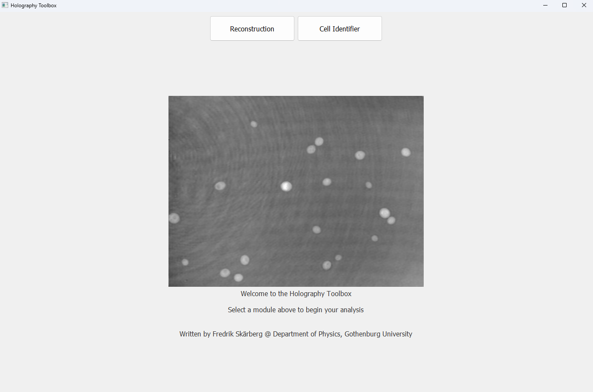
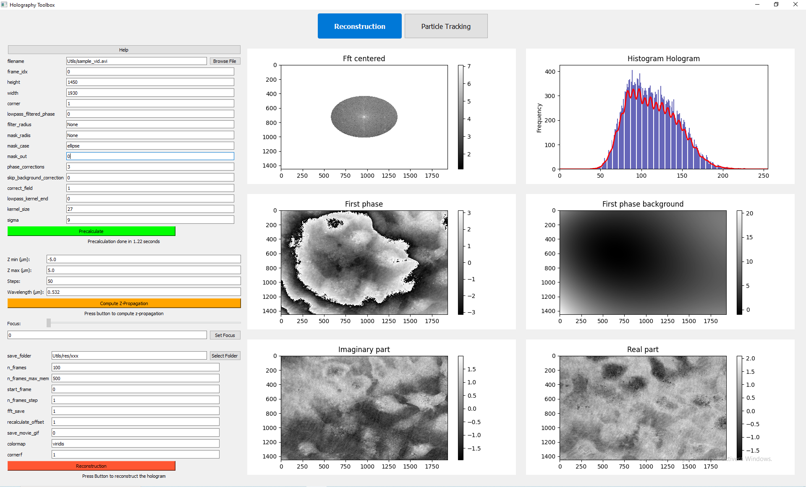
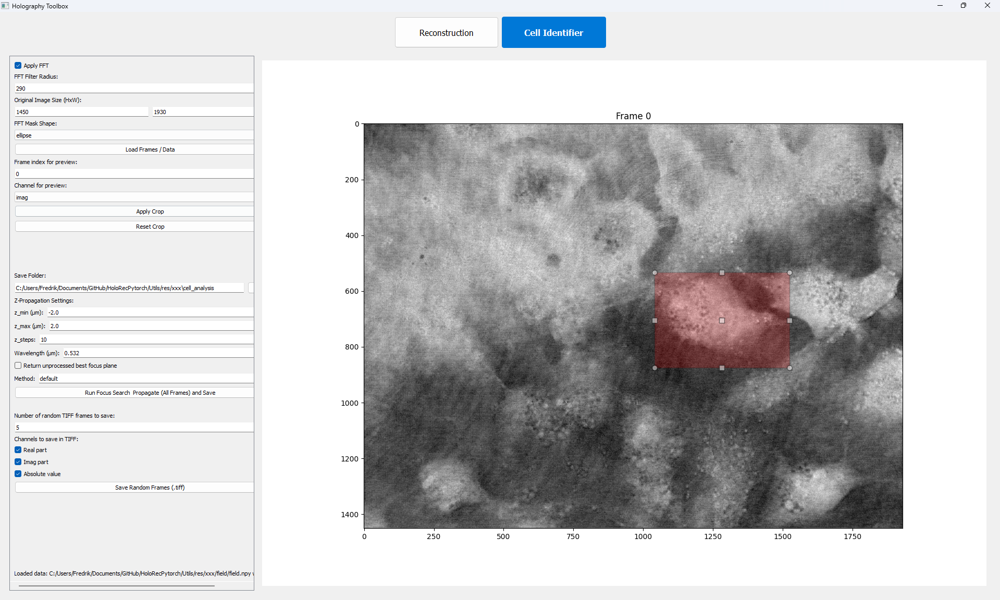

# Holographic Reconstruction in PyTorch

An interactive **desktop GUI** for digital holographic microscopy:
- **Reconstruct holograms** in PyTorch.
- **Crop and analyse** regions of interest.
- **Save** high–quality images or videos.

---

## Features
- **Reconstruction module**
  - Numerical propagation with adjustable `z` distance and wavelength.
  - Optional Fourier‐domain (FFT) filtering.
  - Save reconstructed fields as images or video.

- **Cell Identifier module**
  - Load large `.npy` datasets (supports memory–mapped files).
  - Optional FFT preview of frames.
  - Interactive cropping with the mouse.
  - Simple automatic focus finding (z–propagation) on all frames.
  - Save cropped, focused data as `.npy` or random frames as multi-page TIFF.

---

## Quick Start

###  Install dependencies
```bash
pip install -r requirements.txt
````

(Python ≥3.9 recommended)

### Launch the GUI

```bash
python MAIN.py
```

A window will open where you can:

* Choose input folder or `.npy` file,
* Adjust reconstruction settings,
* Crop, find focus, and save results.

---

### Start Page

This is the landing page shown when you launch `MAIN.py`. Use it to choose which module you want to open. 



---

### Holographic Reconstruction Module

Controls for numerical propagation and reconstruction of holograms. Set the propagation distance `z`, apply FFT filtering, and preview the reconstructed field. 



---

### Cell Identifier Module

Load large `.npy` datasets, interactively crop a region of interest, and run automatic focus finding. You can then save the cropped focused frames as `.npy` or export selected frames as multi-page TIFF. 



---

## Project Layout

```
├── MAIN.py                      # Launches the GUI
├── reconstruction_module.py      # Holographic reconstruction
├── cell_identifier_module.py     # Cropping & focus finder
├── Utils/                        # Icons & screenshots
└── ...
```

---

## License

